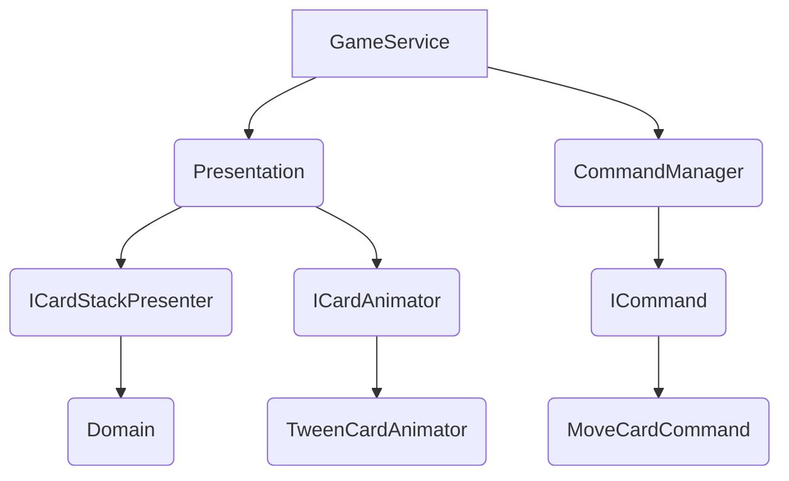

<!--
  ██████╗ ██╗   ██╗██████╗ ██╗   ██╗███████╗
  ██╔══██╗██║   ██║██╔══██╗██║   ██║██╔════╝
  ██████╔╝██║   ██║██████╔╝██║   ██║█████╗  
  ██╔═══╝ ██║   ██║██╔══██╗██║   ██║██╔══╝  
  ██║     ╚██████╔╝██████╔╝╚██████╔╝███████╗
  ╚═╝      ╚═════╝ ╚═════╝  ╚═════╝ ╚══════╝
-->

  
  
  

# Solitaire Card Mover

A clean, SOLID‑compliant Unity project demonstrating card movement, command‑pattern undo/redo, and layered architecture. Use this as a blueprint for building full Solitaire or similar card‑based games.

---

## 📖 Table of Contents

1. [About](#about)
2. [Features](#features)
3. [Architecture](#architecture)
4. [Usage](#usage)
5. [Future Improvements](#future-improvements)
6. [AI Contributions](#ai-contributions)
7. [License](#license)

---

## 🧐 About

This project refactors a monolithic Unity `GameController` into five clear layers:

* **Domain**: Pure game state (`CardModel`, `CardStack`).
* **Presentation**: Unity adapters (`ICardView`, `CardStackPresenter`).
* **Animation**: Movement abstraction (`ICardAnimator`, `TweenCardAnimator`).
* **Command**: Undo/redo system (`ICommand`, `CommandManager`).
* **Service**: `GameService` wires dependencies, deals cards, and handles input.

The result is a highly maintainable, testable foundation for building advanced card games.

---

## 🚀 Features

* **SOLID Layers**: Clear separation of concerns for state, view, animation, and input.
* **Command Pattern**: Execute, undo, and redo card moves.
* **Tween‑Based Animation**: Pluggable `ICardAnimator` interface.
* **Scalable**: Easy to extend with full Solitaire rules, additional animations, or alternative UI.

---

## 🏗️ Architecture

* **GameService**: Composition root and MonoBehaviour entry point.
* **Presentation**: Takes domain models and updates Unity `Transform`s.
* **Animation**: Defines how cards move on screen (tweens by default).
* **Command**: Wraps moves in undoable/redoable actions.

---

## 🎮 Usage

* **Left‑click** a card to move it between the two stacks.
* **Undo** and **Redo** via UI buttons in the top‑right.

> 📌 Cards animate with a smooth tween; you can swap out `TweenCardAnimator` for another implementation.

---

## 🛣️ Future Improvements

* **Unit & Integration Tests**: Verify core logic (`CardStack`) and command workflows.
* **Dependency Injection**: Integrate Zenject for cleaner composition and testing.
* **View Pooling**: Reuse `CardView` instances to optimize runtime performance.
* **Full Solitaire Rules**: Implement cascades, foundations, scoring, and victory conditions.
* **Mobile Touch Support**: Add drag‑and‑drop and touch interactions.

---

## 🤖 AI Contributions

* **README Drafting**: Structured the README with sections, badges, and a diagram.
* **Organization Tips**: Suggested table of contents layout, section headers, and formatting conventions.
* **Brainstorming Prompts**: Explored undo/redo strategies and folder structuring guidance.

---

## 📄 License

Distributed under the MIT License. See `LICENSE` for details.
